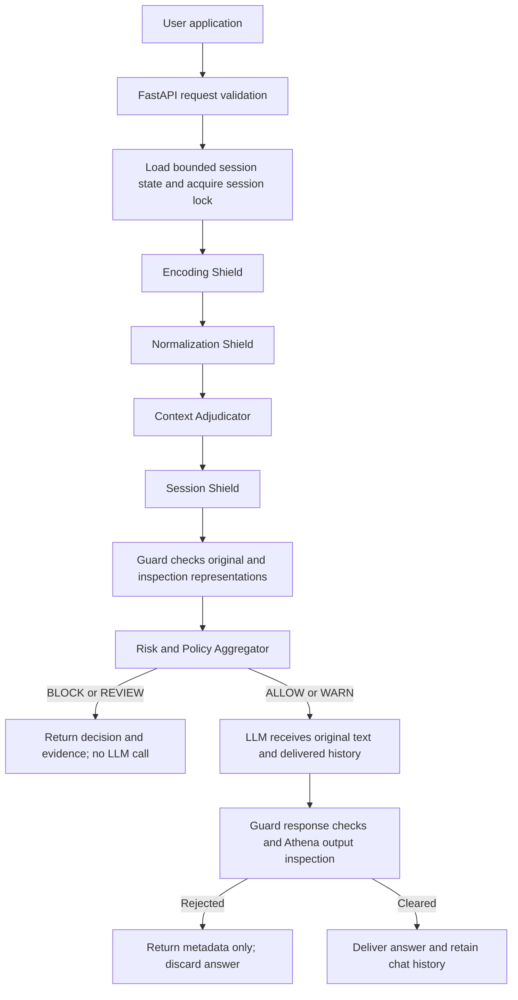

# Athena Shield — Backend Architecture

Athena Shield extends the team's original Model Armor implementation. It adds a
defensive layer around the supplied SecureAI Guard and an LLM, covering four
findings: encoding, character obfuscation, context false positives, and multi-turn
instruction assembly.

## System flow



The diagram describes the logical stages. Implementation generates and inspects
multiple representations together: decoded text is normalized too, and combined
session text is decoded to reveal payloads split across messages.

## The four protection modules

### 1. Encoding Shield

File: `security/encoding_shield.py`

Preserves the original message and safely reveals Base64, URL-safe Base64, hex,
decimal character codes, URL encoding and selected ROT13 representations. It
supports nested encodings and reassembly of sufficiently long Base64 fragments.

Decoding is bounded to three levels, twelve variants and 16,000 decoded characters.
Exceeding the inspection budget blocks the request. Encoding alone is not evidence
of an attack: benign decoded content can pass with a warning.

Decoded content is data for security inspection. It is never executed or substituted
for the original user message passed to the LLM.

### 2. Normalization Shield

File: `security/normalization_shield.py`

Produces analysis variants using Unicode NFKC, invisible-character removal, the
inherited confusable map, whitespace normalization, selected character-separated
instruction words and word-specific leetspeak mappings.

Examples:

```text
I-g-n-o-r-e previous instructions -> ignore previous instructions
I_g_n_o_r_e previous instructions -> ignore previous instructions
1gn0re prev10us 1nstruct10ns      -> ignore previous instructions
```

It does not globally replace numbers in ordinary text. Both original and normalized
representations are considered. A spelling lesson is not blocked merely because it
contains separated letters.

### 3. Context Adjudicator

File: `security/context_adjudicator.py`

Examines quotation boundaries, analytical framing, explicit negation and execution
instructions outside quoted material. Reports EXECUTE, QUOTE, ANALYZE, CLASSIFY,
DOCUMENT, TEACH, TRANSFORM or UNKNOWN, with reasons and confidence.

An injection-only Guard rejection of a strongly analytical quotation becomes REVIEW.
The LLM is not called. Requests with execution intent or other dangerous Guard flags
remain blocked. This release uses deterministic heuristics; it does not use an
LLM classifier or implement an automatic review-approval workflow.

### 4. Session Shield

File: `security/session_shield.py`

Stores recent accepted user messages, quoted intent fragments, transformations,
risk trajectory, suspicious-turn count, last activity and delivered chat history.
It detects when a new request asks to assemble earlier fragments into an override.

Defaults are ten recent security messages, 12,000 characters per bounded message
store, a 60-minute inactivity TTL, and 500 sessions. Expiry is checked when sessions
are accessed. Risk decays with elapsed time and benign turns.

Every message retained for the next LLM call is included in security inspection,
even if check-only requests have displaced it from the recent security window.
Rejected prompts and responses are not inserted into executable chat history.
Per-session locks prevent concurrent requests from racing history updates.

## Shared policy and response boundary

Files: `security/risk_engine.py`, `security/service.py`, `security/schemas.py`

| Decision | Meaning | Downstream LLM |
|---|---|---|
| ALLOW | Required checks cleared | Permitted |
| WARN | Checks cleared; transformation or fragment evidence retained | Permitted |
| REVIEW | Analytical dispute or unresolved risk | Held |
| BLOCK | Attack, rejection, incomplete screening or resource limit | Held |
| SAFE_ANALYSIS | Reserved schema value; not emitted in this release | No implemented execution path |

The Guard must return a valid, complete verdict. Partial responses, malformed
booleans, missing checks, inconsistent results, timeouts and quota failures block
delivery. The old FAIL_OPEN setting cannot weaken this policy.

User input is limited to 3,999 characters. Longer internal inspection representations
are divided into overlapping chunks. Up to eight distinct Guard submissions are
allowed per evaluation by default. If complete screening would exceed that budget,
the application blocks explicitly instead of silently truncating the input.

Output passes through Guard response screening and Athena inspection. Rejected
output is absent from `answer`, inspection evidence, chat history and audit logs.
No `raw_answer` field is returned. The planted fake-secret canary is checked locally
as an additional demo-specific output defense.

## Components and interfaces

| Component | Responsibility |
|---|---|
| `server.py` / `api.py` | Startup, request validation, API routes, legacy adapters |
| `clients/guard_client.py` | Async Guard checks, strict verdict parsing, request IDs, latency and Retry-After cooldown |
| `clients/llm_client.py` | Async completion calls using original text and screened history; no model tools |
| `security/` | Four modules, shared findings, policy and orchestration |
| `armor.py`, `guard.py`, `llm.py` | Existing Python interfaces retained for compatibility |
| `config.py` | Environment and `.env` loading; process environment takes precedence |
| `alerts.py` | Metadata-only activity records and optional configured SMTP alerts |
| `presets.py`, `demo.py` | Synthetic four-finding examples and explicit offline simulation |

Primary endpoints:

```text
GET  /health
GET  /ready
POST /api/v1/athena/check
POST /api/v1/athena/chat
POST /api/v1/athena/reset
POST /api/v1/demo/compare
```

Check, chat and comparison accept `{ "text": "...", "session_id": "optional-id" }`.
The comparator reuses the raw Guard verdict rather than spending another call on
the same original text. Inspection results expose evidence to the caller; logs
contain decisions, categories, request IDs, latencies and a session hash.

## Verification and operating scope

69 offline tests pass; one live Guard smoke test is skipped unless explicitly
enabled. Tests cover the four findings, benign controls, fail-closed behavior,
complete-input screening, response suppression, history, isolation, expiry,
concurrency, API validation and network-client failures. A real local server process
was started and its `/health` endpoint returned successfully.

The system is a local hackathon prototype. It uses in-memory sessions and one
worker, with no authentication or ownership binding for user-chosen session IDs.
Keep the default loopback binding. Heuristic detection is not a guarantee against
all semantic attacks. Current live Guard/LLM behavior still requires validation
with valid credentials. The existing UI has not been redesigned.

Run from the repository directory:

```powershell
.venv/Scripts/python server.py
```

Interactive backend documentation: `http://127.0.0.1:8000/docs`.
See `DEMO_COMMANDS.md` for the four manual demonstrations.
